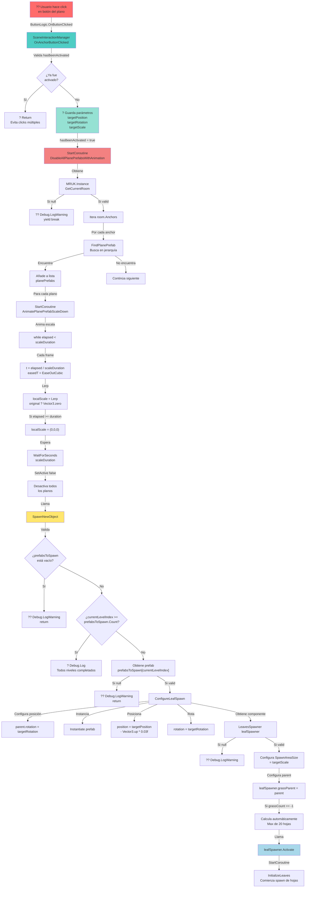
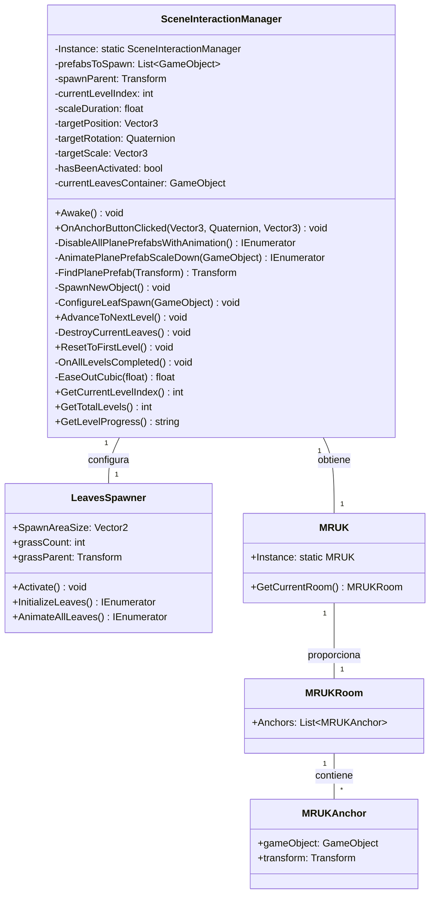
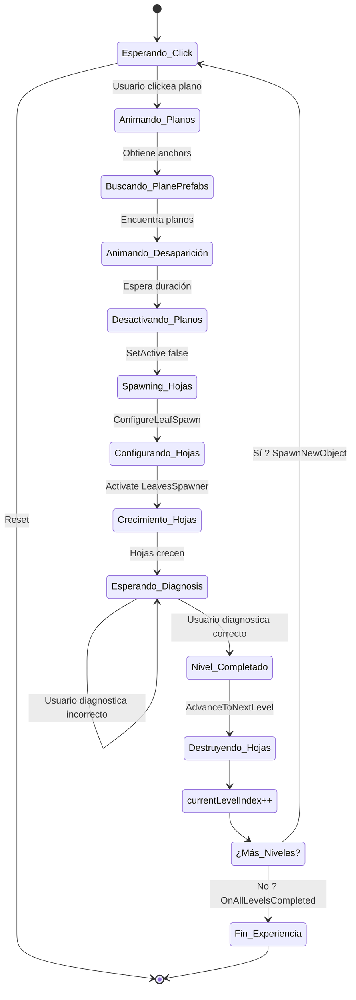
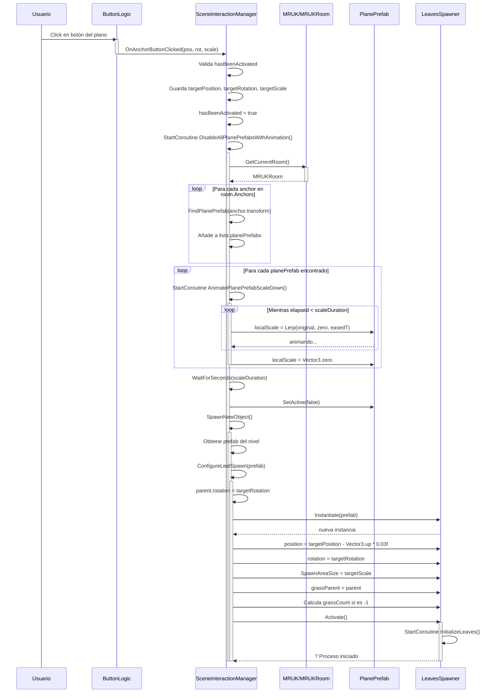
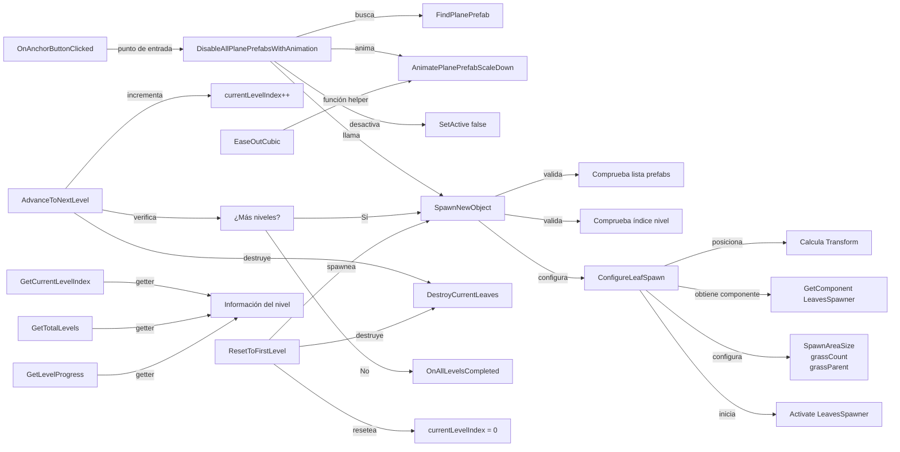
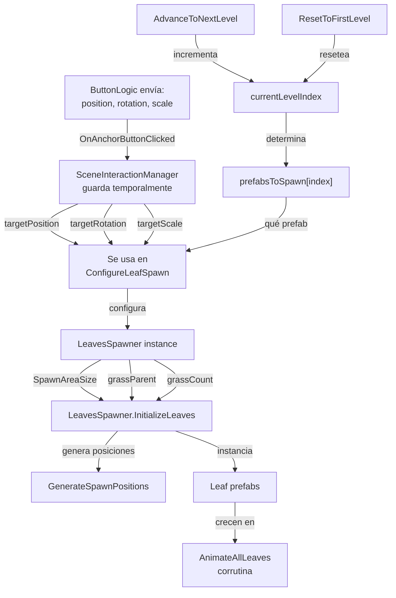
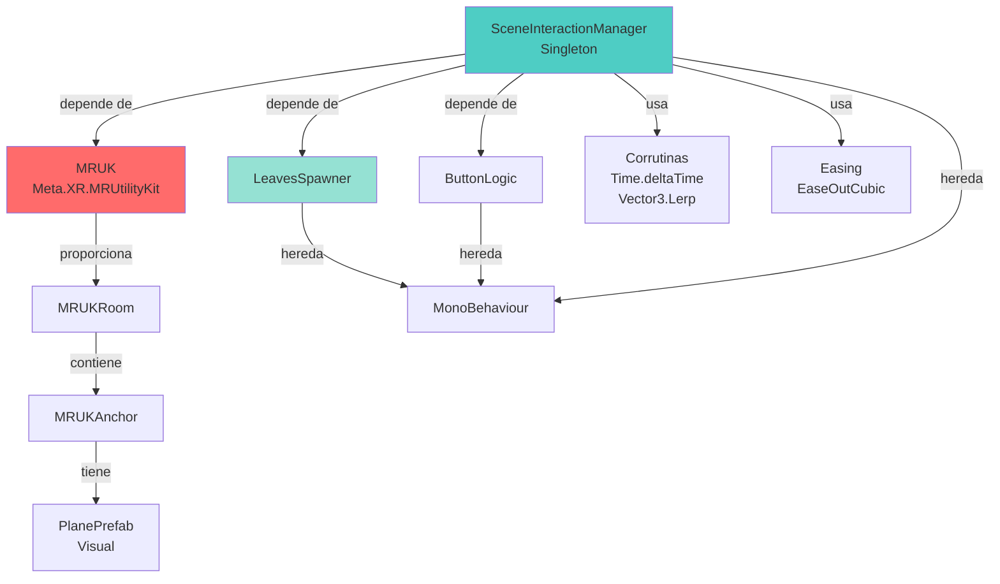

# Diagrama de SceneInteractionManager en Mermaid

## 1. DIAGRAMA DE FLUJO COMPLETO



---

## 2. DIAGRAMA DE ESTRUCTURA DE CLASES Y PROPIEDADES



---

## 3. DIAGRAMA DE PROGRESIÓN DE NIVELES



---

## 4. DIAGRAMA SECUENCIAL: DESDE CLICK HASTA SPAWN



---

## 5. DIAGRAMA DE MÉTODOS Y RESPONSABILIDADES



---

## 6. DIAGRAMA DE FLUJO DE DATOS



---

## 7. TABLA DE TRANSICIONES DE ESTADO

| Estado | Evento | Acción | Nuevo Estado |
|--------|--------|--------|--------------|
| Esperando | Click | OnAnchorButtonClicked | Animando Planos |
| Animando Planos | Tiempo transcurrido | DisableAllPlanePrefabsWithAnimation | Spawning Hojas |
| Spawning Hojas | Prefab instanciado | ConfigureLeafSpawn | Crecimiento Hojas |
| Crecimiento Hojas | LeavesSpawner.Activate | AnimateAllLeaves | Diagnosis |
| Diagnosis | Usuario diagnostica correcto | AdvanceToNextLevel | Destruyendo/Esperando |
| Diagnosis | Usuario diagnostica incorrecto | ShowFeedback | Diagnosis |
| Destruyendo | Hojas destruidas | currentLevelIndex++ | ¿Más Niveles? |
| ¿Más Niveles? | Sí | SpawnNewObject | Esperando |
| ¿Más Niveles? | No | OnAllLevelsCompleted | Fin |

---

## 8. DIAGRAMA DE DEPENDENCIAS EXTERNAS



---

## 9. PSEUDO-CÓDIGO DEL FLUJO PRINCIPAL

```
CLASE SceneInteractionManager (Singleton):

 CUANDO Usuario Clickea Plano:
     1. OnAnchorButtonClicked(pos, rot, scale)
  2. SI hasBeenActivated == false:
  a. Guardar parámetros (pos, rot, scale)
       b. hasBeenActivated = true
       c. Iniciar DisableAllPlanePrefabsWithAnimation()
   3. SINO: Ignorar
    
    EN DisableAllPlanePrefabsWithAnimation:
        1. Obtener MRUKRoom desde MRUK.Instance
        2. PARA cada anchor en room.Anchors:
   a. Buscar PlanePrefab en jerarquía
        b. INICIAR AnimatePlanePrefabScaleDown(plano)
        3. ESPERAR scaleDuration segundos
      4. Desactivar todos los planos encontrados
        5. Llamar SpawnNewObject()
    
    EN AnimatePlanePrefabScaleDown:
        1. Guardar escala original
        2. MIENTRAS elapsed < scaleDuration:
            a. Calcular t normalizado (0-1)
    b. Aplicar easing: easedT = EaseOutCubic(t)
   c. Lerp escala: de original a Vector3.zero
         d. Esperar próximo frame
     3. Asegurar localScale = Vector3.zero
  
    EN SpawnNewObject:
      1. VALIDAR prefabsToSpawn no vacío
        2. VALIDAR currentLevelIndex < prefabsToSpawn.Count
        3. Obtener prefab del nivel actual
4. Llamar ConfigureLeafSpawn(prefab)
    
    EN ConfigureLeafSpawn:
        1. Configurar parent transform
        2. Instantiate prefab en la ubicación
        3. Obtener componente LeavesSpawner
        4. CONFIGURAR:
            - SpawnAreaSize = targetScale
      - grassParent = parent
            - grassCount = cálculo automático SI -1
        5. Llamar leafSpawner.Activate()
    
    CUANDO AdvanceToNextLevel:
        1. Destruir todas las hojas actuales
        2. Incrementar currentLevelIndex
  3. SI currentLevelIndex >= prefabsToSpawn.Count:
            - Llamar OnAllLevelsCompleted()
 4. SINO:
      - Llamar SpawnNewObject()
    
    CUANDO ResetToFirstLevel:
        1. Destruir todas las hojas actuales
        2. currentLevelIndex = 0
        3. Llamar SpawnNewObject()
```

